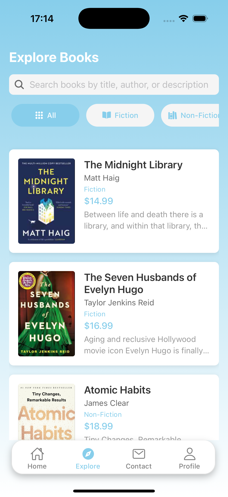
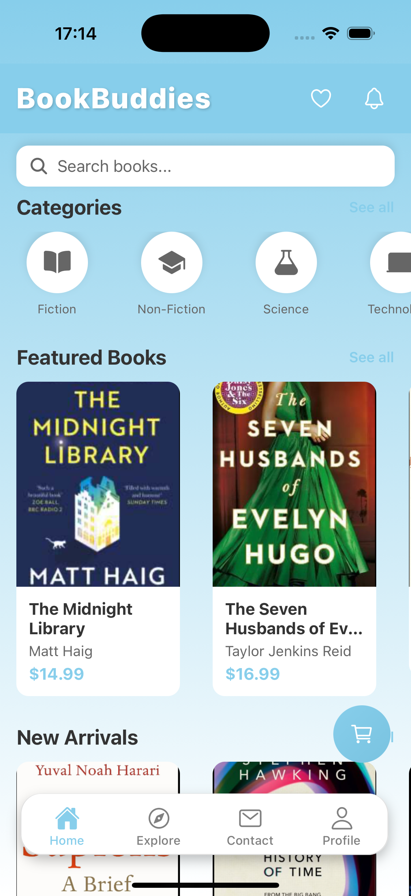

# 📚 BookBuddies

<div align="center">
  
  
</div>

## 🌟 Your Personal Book Companion

BookBuddies is your ultimate mobile companion for managing and organizing your book collection. Built with React Native and Expo, it brings your reading experience to life with a beautiful, intuitive interface.

## 💡 Why Local Storage?

In this demo version (1.0.0), BookBuddies uses local storage primarily for testing and demonstration purposes:

<div align="center">
  <table>
    <tr>
      <td align="center">🎯 Demo Ready</td>
      <td align="center">🚀 Quick Testing</td>
      <td align="center">💻 Easy Development</td>
    </tr>
    <tr>
      <td align="center">Perfect for showcasing features</td>
      <td align="center">Instant feedback during development</td>
      <td align="center">No backend setup required</td>
    </tr>
    <tr>
      <td align="center">📱 Prototype Friendly</td>
      <td align="center">🔄 Rapid Iteration</td>
      <td align="center">🔍 Feature Validation</td>
    </tr>
    <tr>
      <td align="center">Easy to modify and test</td>
      <td align="center">Quick development cycles</td>
      <td align="center">Validate core functionality</td>
    </tr>
  </table>
</div>

## ✨ Key Features

<div align="center">
  <table>
    <tr>
      <td align="center">📱 Cross-platform</td>
      <td align="center">📚 Book Management</td>
      <td align="center">🎯 Reading Lists</td>
    </tr>
    <tr>
      <td align="center">🛒 Shopping Cart</td>
      <td align="center">❤️ Favorites</td>
      <td align="center">🔔 Notifications</td>
    </tr>
    <tr>
      <td align="center">📝 Book Posting</td>
      <td align="center">💰 Order Processing</td>
      <td align="center">👤 Profile Management</td>
    </tr>
  </table>
</div>

## 🚀 Getting Started

### Prerequisites
- Node.js (v14 or higher)
- npm or yarn
- Expo CLI
- iOS Simulator (Mac) or Android Studio (Android)

### Quick Start
```bash
# Clone the repository
git clone [your-repository-url]
cd BookBuddies

# Install dependencies
npm install
# or
yarn install

# Start the development server
npm start
# or
yarn start
```

## 💻 Running the App

<div align="center">
  <table>
    <tr>
      <td align="center">iOS</td>
      <td align="center">Android</td>
      <td align="center">Web</td>
    </tr>
    <tr>
      <td align="center"><code>npm run ios</code></td>
      <td align="center"><code>npm run android</code></td>
      <td align="center"><code>npm run web</code></td>
    </tr>
  </table>
</div>

## 🛠️ Tech Stack

### Frontend
<div align="center">
  
  
  
</div>

### Data Management
- Local Storage (AsyncStorage)
- Context API for state management
- Mock data for initial content

## 📁 Project Structure

```
BookBuddies/
├── 📁 assets/          # Static assets
├── 📁 src/            # Source code
│   ├── 📁 components/ # UI components
│   ├── 📁 screens/    # Screen components
│   ├── 📁 context/    # Context providers
│   ├── 📁 navigation/ # Navigation config
│   └── 📁 utils/      # Utility functions
├── 📄 App.js          # Main component
├── 📄 index.js        # Entry point
└── 📄 package.json    # Dependencies
```

## 🔮 Future Roadmap

<div align="center">
  <table>
    <tr>
      <td align="center">🌐 Backend Integration</td>
      <td align="center">☁️ Cloud Storage</td>
      <td align="center">🔔 Push Notifications</td>
    </tr>
    <tr>
      <td align="center">👥 Social Features</td>
      <td align="center">💳 Payment Integration</td>
      <td align="center">📊 Reading Analytics</td>
    </tr>
  </table>
</div>

## 🤝 Contributing

We welcome contributions! Here's how you can help:

1. 🍴 Fork the repository
2. 🌿 Create your feature branch (`git checkout -b feature/AmazingFeature`)
3. 💾 Commit your changes (`git commit -m 'Add some AmazingFeature'`)
4. 📤 Push to the branch (`git push origin feature/AmazingFeature`)
5. 🔄 Open a Pull Request

## 📄 License

This project is licensed under the 0BSD License - see the [LICENSE](LICENSE) file for details.

## 📌 Version

<div align="center">
  
</div>

---
<div align="center">
  Made with ❤️ by <a href="https://github.com/saisengmain">saisengmain</a>
</div> 